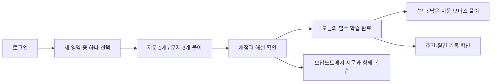
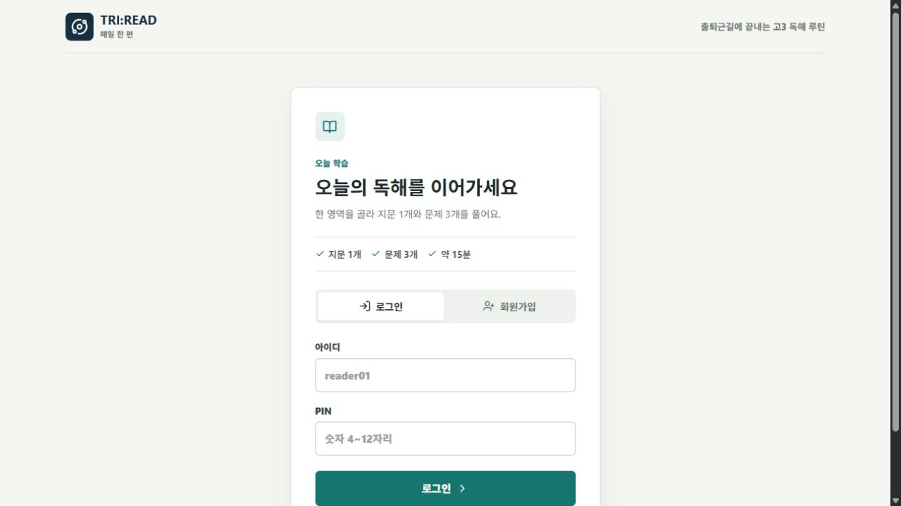
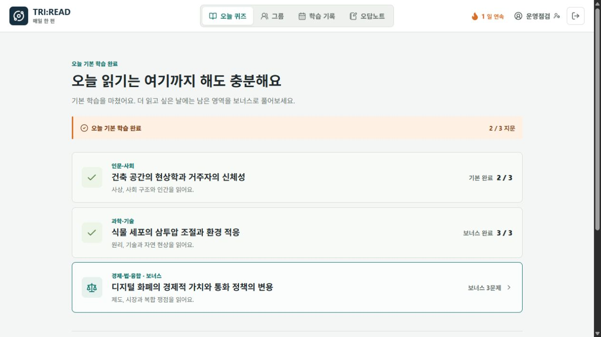
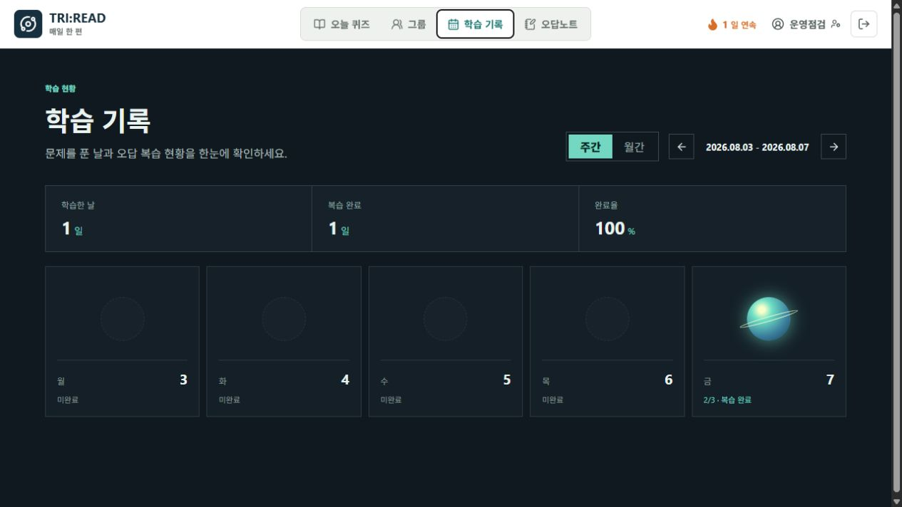
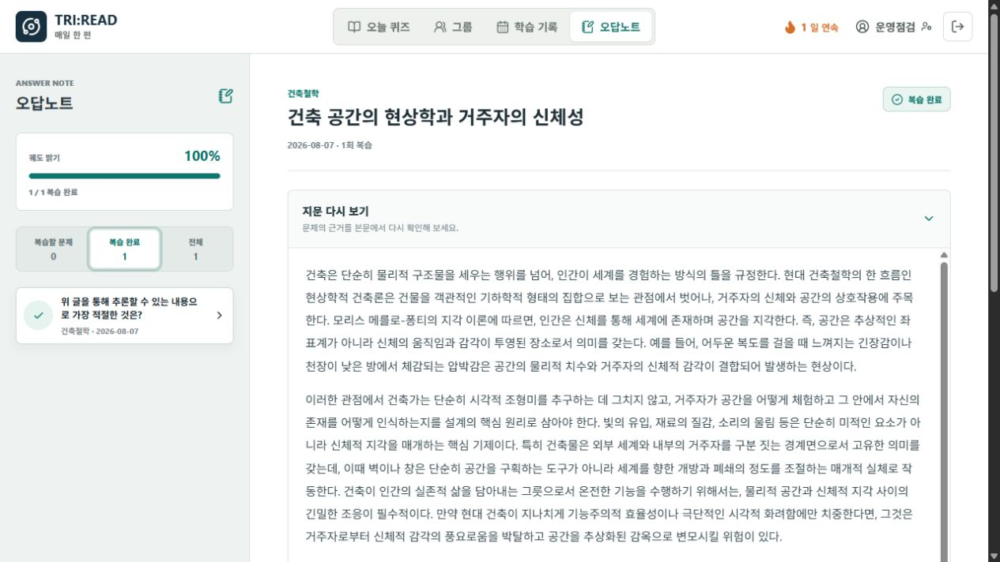
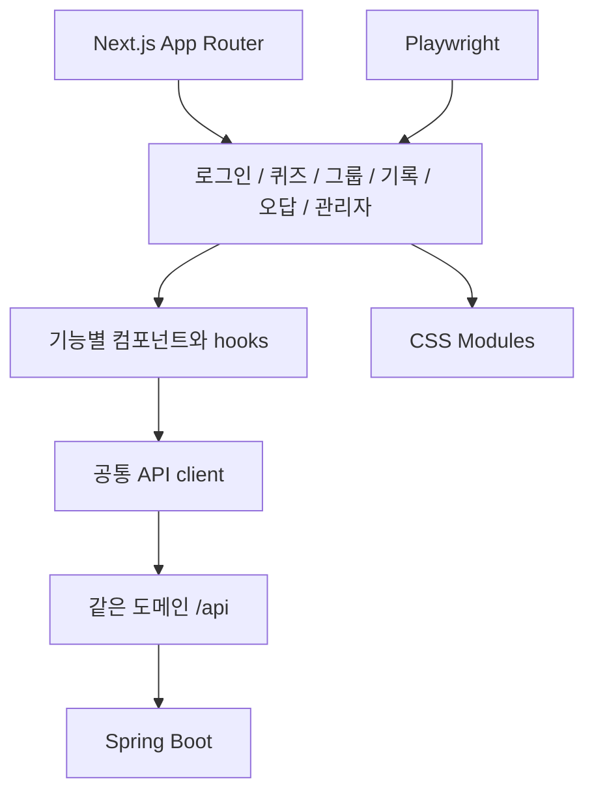
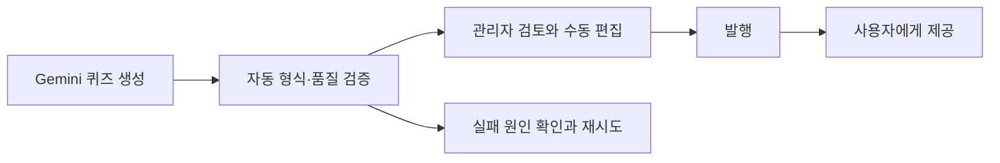

# TRI:READ 프론트엔드 설계

TRI:READ는 긴 학습 세션보다 이동 중 10~15분의 짧은 독해 습관을 목표로 합니다. 사용자는 세 영역 중 하나를 고르고 지문 1개와 문제 3개만 풀면 오늘 학습을 마칠 수 있습니다.

## 사용자 흐름

## 화면 구성

### 로그인

서비스 설명보다 로그인과 회원가입을 먼저 보여 주며, 인증 전에는 개인 학습 기록을 노출하지 않습니다.

### 오늘의 퀴즈

필수 학습과 보너스 학습을 분리합니다. 한 지문을 마친 사용자는 부담 없이 종료하거나 다른 영역을 이어서 선택할 수 있습니다.

### 학습 기록과 오답 복습

| 학습 기록 | 오답 복습 |
| --- | --- |
|  |  |

학습 기록은 주간·월간 단위로 완료일을 보여 줍니다. 오답 상세에서는 문제만 떼어 놓지 않고 원문 지문과 해설을 함께 확인할 수 있습니다.

## 프론트 구조

각 상단 메뉴는 화면 상태만 바꾸는 탭이 아니라 실제 URL을 가집니다. 따라서 뒤로가기, 새로고침과 직접 링크 접근이 동작합니다. 운영에서는 Caddy가 정적 파일과 `/api/*` 요청을 같은 도메인에서 제공합니다.

## 주요 설계 결정

| 결정 | 이유 |
| --- | --- |
| Next.js App Router | 메뉴별 URL과 브라우저 기록을 보장하고 정적 배포 경로를 명확히 관리합니다. |
| JavaScript | 프로젝트 범위와 학습 배경에 맞춰 불필요한 도구 전환 없이 구현합니다. |
| CSS Modules | 화면별 스타일 책임을 나누면서 기존 CSS 지식을 그대로 활용합니다. |
| 같은 출처의 상대 API 경로 | 운영 CORS 구성을 줄이고 세션 쿠키와 CSRF 흐름을 단순하게 유지합니다. |
| 브라우저 임시 저장소의 풀이 초안 | 새로고침이나 모바일 화면 전환 뒤에도 선택한 답을 복원합니다. |
| 데스크톱·모바일 E2E | 기능뿐 아니라 가로 넘침, 글자 크기와 지문 접근성을 함께 확인합니다. |

## 관리자 운영 흐름

운영 화면은 생성 기록, 검증 점수, 출처, 발행 상태와 실패 원인을 한곳에서 확인합니다. 일반 사용자는 관리자 경로에 접근할 수 없고, 대량 발행과 삭제는 선택한 항목만 처리합니다.

## 해결한 문제

### 메뉴 이동 후 뒤로가기가 서비스를 이탈함

초기에는 한 페이지 내부 상태로 메뉴를 바꿔 브라우저 기록이 남지 않았습니다. 각 메뉴를 App Router 경로로 분리해 뒤로가기, 새로고침과 URL 공유가 동작하도록 바꿨습니다.

### 모바일에서 지문과 문제가 읽기 어려움

고정된 2열 배치가 작은 화면에서도 유지되어 지문 폭과 선택지 높이가 부족했습니다. 모바일에서는 지문과 문제를 순서대로 배치하고 진행 상태와 지문 다시 보기 동작을 유지했습니다. Playwright에서 가로 넘침과 최소 가독성 조건을 확인합니다.

### 미래 날짜가 미완료로 표시됨

학습 기록이 이번 주의 미래 평일까지 모두 `미완료`로 보여 사용자에게 실패처럼 느껴졌습니다. 현재 날짜 이후는 `예정`으로 분리하고 데스크톱·모바일 시나리오에 회귀 테스트를 추가했습니다.

### 완료 뒤 지문을 다시 볼 수 없음

결과와 오답 화면이 문제 중심이라 독해 맥락을 다시 찾기 어려웠습니다. 오늘의 완료 화면과 오답 상세에서 원문 지문을 다시 열 수 있게 하고 모바일에서도 접근 가능한지 검증합니다.

### 퀴즈가 없는 상태와 서버 장애가 같은 안내로 보임

초기에는 오늘 퀴즈가 아직 없는 경우와 API 장애가 모두 같은 빈 화면으로 표시됐습니다. 백엔드 오류 코드를 보존해 미등록 상태에는 대기 안내를, 서버 오류에는 재시도 안내와 경고 역할을 표시하도록 분리했습니다.

### 오답이 많을 때 항목을 다시 찾기 어려움

오답 상세를 닫고 목록에서 다음 문제를 다시 찾던 흐름을 이전·다음 탐색으로 줄였습니다. 키보드 포커스를 명확히 표시해 마우스 없이도 주요 버튼과 입력 요소를 이동할 수 있습니다.

## 검증 근거

- `npm run build`: Next.js 프로덕션 빌드 성공 (2026-08-09 `dev`)
- `npm run test:e2e`: 21개 통과, 1개 의도적 제외
- 검증 화면: 로그인, 필수·보너스 퀴즈, 오답 복습, 주간 기록, 그룹, 관리자 품질 화면
- 뷰포트: 데스크톱 Chromium과 모바일 Chromium
- CI: 빌드, Playwright, `npm audit`, CodeQL, 운영 HTML 스모크 테스트
